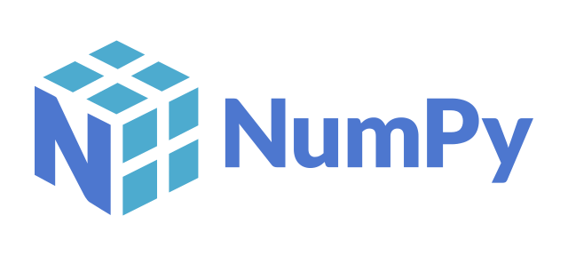

<h1 align="center">Ahoy World </h1>

<h3 align="center">
   I am <strong>Otsogile Onalepelo aka Morena</strong>
  <!---->
</h3>

<h2 align="center">
    Biomedical Engineer || AI Engineer || Software Engineer
</h2> 

I am an experienced self-taught software engineer, a qualified AI engineer and an allied health professional. A multipotentialite if you may. With the ability to quickly learn complex things on a need-to-know basis and apply them. My leisure time is spent researching and learning business & economic models, and how they can be optimized using technology.

## 🔭 I'm currently working on
- Building a portfolio and documenting my projects
- An NFT cross platform mobile application
- An NFT recommender system to incoporate into the NFT mobile application i am currently building
- Maintaining some of my current projects

## 🌱 I'm currently learning
- New AI & DL methods and models
- Keep myself updated with data releted techniques and methods
- Advanced programming skills
- New programming frameworks and libraries 

## 💼 Technical Skills

  <code></code>
  <code></code>
  <code></code>
  <code></code>
  <code></code>
  <code></code>
  <code></code>
  <code></code>
  <code></code>
  <code></code>
  <code></code>
  <code></code>
  <code></code>
  <code></code>
  <code></code>
  <code></code>
  <code></code>
  <code></code>
  <code></code>
  <code></code>
  <code></code>
  <code></code>
  <code></code>
  <code></code>
  <code></code>
  <code></code>
  <code></code>
  <code></code>
  <code></code>
  <code></code>
  <code></code>
  <code></code>

## 📈 GitHub Stats
<!-- https://github.com/anuraghazra/github-readme-stats -->

   
 

 

    
  
  

   
  <!--
  

  
 

 -->

 

### 🤝 Get in touch:

 
- 💼 For any collaboaration or freelance work, lets connect => [email](mailto:hireme@morena.dev)
- 💬 If you have any questions/feedback, please do not hesitate to reach out to me!

⚡ Fun fact: Yay ! a different error message...Finally some progress !

